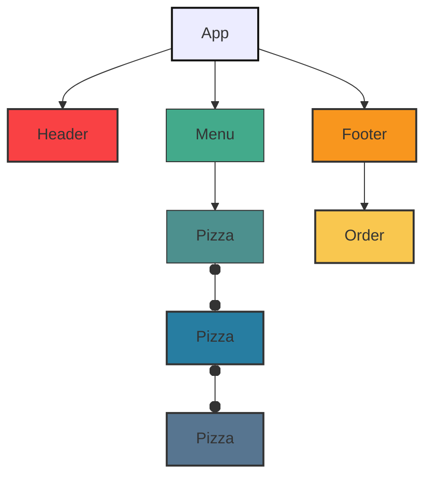

# Component Tree of Pizza Menu

```mermaid
graph TD;
    A[App] --> H[Header];
    A --> M[Menu];
    A --> F[Footer];

    M --> P1[Pizza];
    P1 o--o P.[Pizza];
    P. o--o Pn[Pizza];

    F --> O[Order];

    style A fill:#,stroke:#111111,stroke-width:2px;

    style H fill:#f94144,stroke:#333,stroke-width:2px;
    style F fill:#f8961e,stroke:#333,stroke-width:2px;
    style O fill:#f9c74f,stroke:#333,stroke-width:2px;

    style M fill:#43aa8b,stroke:#333,stroke-width:2px;43aa8b
    style P1 fill:#4d908e,stroke:#333,stroke-width:2px;4d908e
    style P. fill:#277da1,stroke:#333,stroke-width:2px;
    style Pn fill:#577590,stroke:#333,stroke-width:2px;
```
